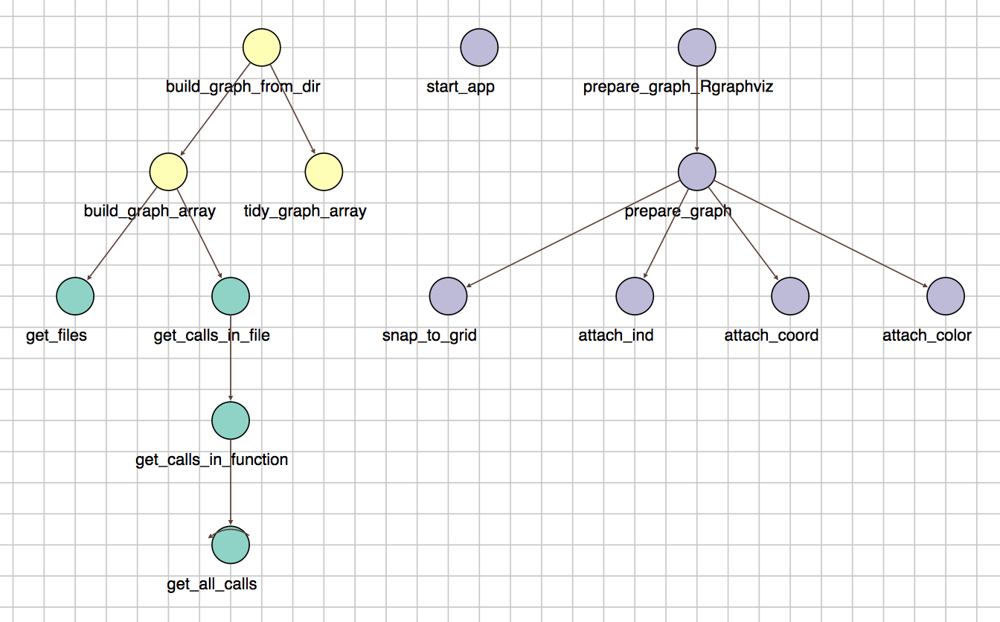
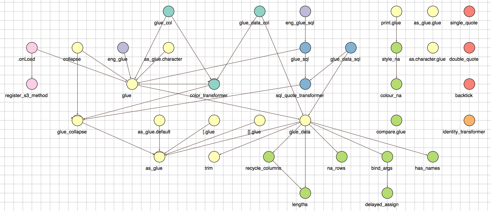

## R package: funGraphs

A simple package to map out dependencies between functions in a directory / package using `rlang` (in contrast to other regex-based packages). This helps analyse packages and refactor code. 

(The package works best for packages with < 50 functions. With larger packages, the diagram would contain too many nodes to be useful.)

---
### News
1. [Hot-fix] Fixed problems with multiple functions having the same name, e.g. ".onLoad", in a package and function names with the disallowed symbol "|". See `?remove_duplicates` and `?remove_vbar` for more detail if you ran into troubles.
2. Added a wrapper function to simplify usage (see Usage 1 below).

--- 
### Usage 1
```
# At the package directory
funGraphs::build_pkg_graph()
```

### Usage 2
```
library(funGraphs)
library(magrittr)

# At the package directory
g0 <- build_graph_from_dir("R/")    # Analyse directory and build 

# `prepare_graph` uses `igraph::layout_with_sugiyama` which works well
# with small (<20) number of nodes
g0 %>% 
  prepare_graph() %>%               # Add plotting parameters
  start_app()                       # Display app

# `prepare_graph_Rgraphviz` uses the default in `Rgraphviz` which
# works well for larger number of nodes.
g0 %>% 
  prepare_graph_Rgraphviz() %>%     # Add plotting parameters
  start_app()                       # Display app
```

--- 

### Example 1: R package 'funGraphs'
From the diagram, we see that `build_graph_from_dir`, `start_app` and `prepare_graph_Rgraphviz`are at the top level. Indeed, they form the interface of the package. (Note that nodes with the same color are from the same file.)

</img>

--- 

### Example 2: R package 'glue'

From the diagram, we see that `glue_collapse` and `glue_data` (and also `as_glue.default`, `[.glue`, `[[.glue`) separate the high-level calls from the low-level functions. From the grouping and naming of the functions, one would guess that

- The light yellow functions provide the core functionality, 
- The bright green ones are the low-level utility functions,
- The dull green, blue, purple ones form the high-level usage functions.

(Minor manual modification, and removal of `%||%` and an extra `.onLoad`)
</img>
